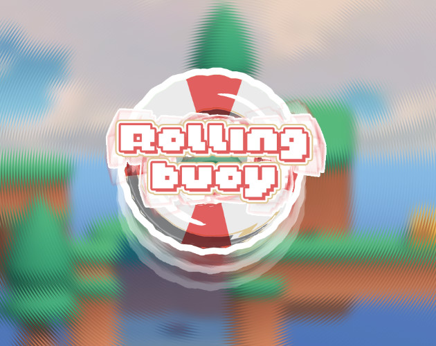

# 🛟 Rollingbuoy

> This game is made in GMTK GameJam 2025

Rollingbuoy is a platform puzzle game where you become a rolling lifebuoy that constantly shifts through loops of transformation. In diorama-style stages, you roll, nest, and combine to unlock mechanisms and open the way forward.

The game revolves around the nesting of rings:

- Insert various objects into your ring to change its weight and properties
- Nest rings within rings to form new shapes and trigger mechanisms
- Switch between laying flat, standing upright, and rolling, trying different paths
- Each transformation pushes the puzzle into a new loop, bringing you closer to the exit, or to the secrets hidden within the ring.

### [Try this game on itch.io](https://gloridifice.itch.io/rollingbuoy)

External assets used:
- Free Stylized
  - https://freestylized.com/
- Kenney
  - https://kenney.nl/assets/survival-kit
  - https://kenney.nl/assets/platformer-kit
  - https://kenney.nl/assets/input-prompts
  - https://kenney.nl/assets/fantasy-ui-borders

